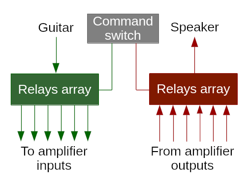
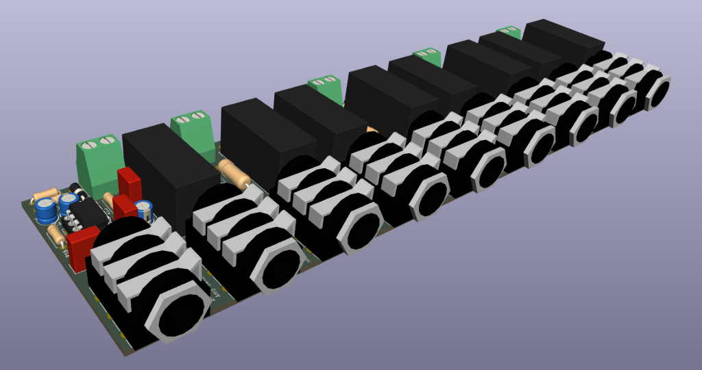
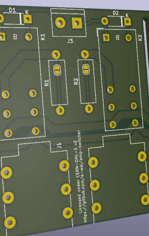
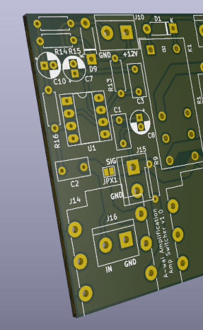
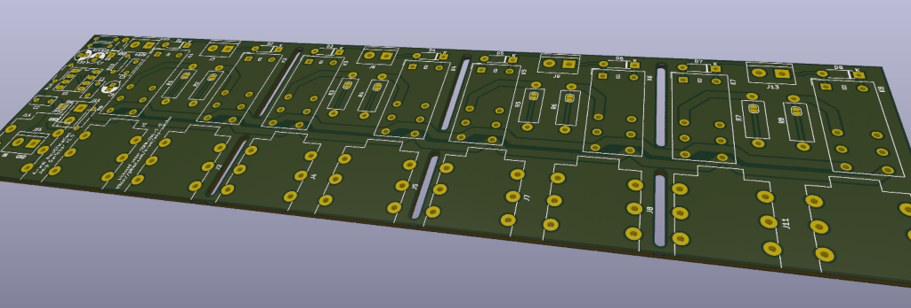

# Amp Switcher

The Amp Switcher is a device for easily switching between (guitar) amplifiers
when a single speaker cabinet is used and/or available.

It is designed so that, at any given moment:
* the guitar input is routed to the selected amp (and only this one!)
* the selected amp's output (and only this one!) is routed to the cab
* all unused amps have their input muted ("shorted" in electrical terms)
* all unused amps have a dummy (resistive) load connected to their speaker
  output

Note: this repository only includes the electronics schematics and PCB designs.
Mechanical design and building is left to the reader's skills and imagination.

## Relays Array

This is the part responsible for the actual switching. In order to minimize the
number of different parts needed, this PCB is meant to be "universal", in the
sense that it can be used both for the "Guitar -> Amp Inputs" section (with an
optional built-in buffer) and for the "Amp Outputs -> Speaker Cab" one.

The board should be populated differently depending on the intended function:
* for a speaker out board, the 2W resistors (R1-R8) should be populated,
  especially when used with tube amplifiers
* guitar in boards shouldn't include those resistors, but instead the
  corresponding solder jumpers should be bridged by applying solder across them

The input/output section (part of the PCB on the left of J1 & K1) can also be
used in 3 different ways:
* external connector for the guitar in/speaker out: do not populate any
  component except J10 (+12V) and J15 (to/from external connector)
* on-board jack connector, direct routing (recommended for speaker out board):
  populate only J14 and J10, and apply solder across JPX1
* on-board jack connector, input buffer (only suitable for guitar in board):
  populate all components except J15

Finally, the PCB is split in blocks of 2 relays, with oblong holes in the board
so it can easily be broken to only keep the needed number of I/Os. This allows
the same design to be used in projects of different sizes.

**WARNING: although using relatively wide (2mm) PCB tracks, we recommend the
boards to be manufactured with 2oz copper weight if they are to be used with
amplifiers above 20W RMS of nominal output power.**

## Control Matrix

TODO (yet to be designed)

## Licensing

Copyright 2025 Arnaud Ferraris.

The 3D models for the Neutrik jacks are © Inventor eFX Technology and have been
downloaded from https://www.inventfx.com/_ifxkicad/_ifxkicadxtra.htm

This source describes Open Hardware and is licensed under the CERN-OHL-S v2.

You may redistribute and modify this source and make products using it
under the terms of the CERN-OHL-S v2 (https://ohwr.org/cern_ohl_s_v2.txt).

This source is distributed WITHOUT ANY EXPRESS OR IMPLIED WARRANTY, INCLUDING
OF MERCHANTABILITY, SATISFACTORY QUALITY AND FITNESS FOR A PARTICULAR PURPOSE.
Please see the CERN-OHL-S v2 for applicable conditions.

Source location: https://github.com/a-wai/amp-switcher

As per CERN-OHL-S v2 section 4, should You produce hardware based on this
source, You must where practicable maintain the Source Location visible on the
PCBs and user documentation of the Amp Switcher or other products you make
using this source.
